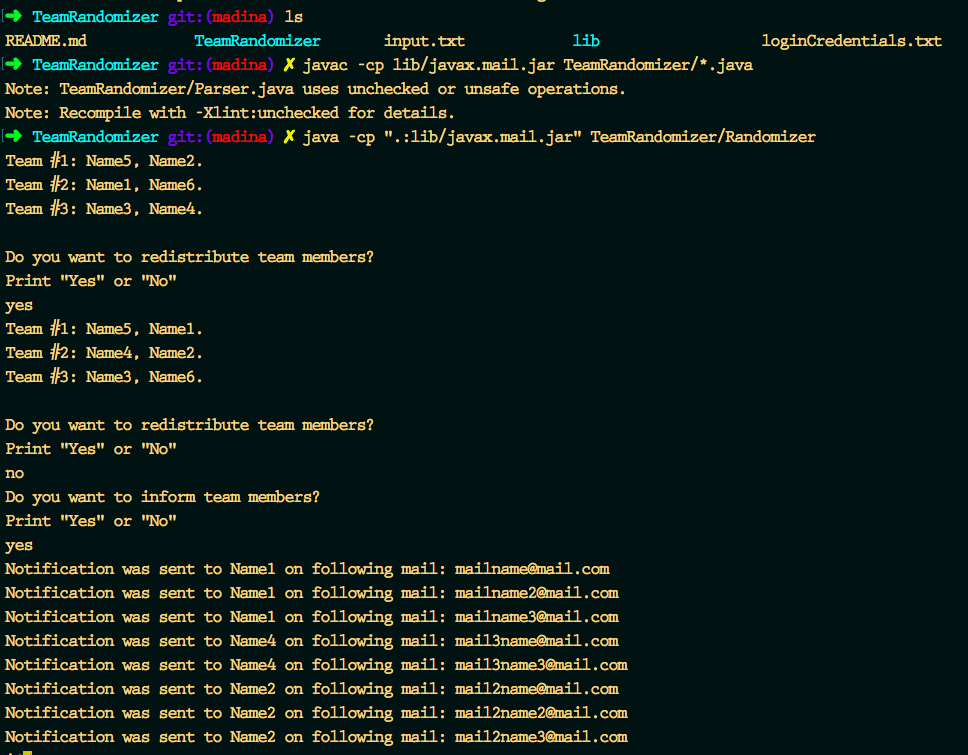

# TeamRandomizer
Randomly separate people into groups and notify each group member about being in a group via gmail.

Usage:

    1. Clone this repo on your computer.

    2. Change loginCredentials.txt file so that:

            1) your gmail login is on line #1

            2) your gmail password is on line #2

            3) size of a team on line #3

    3. Change input.txt file so that:

            1) It contains only name of people you want to divide into groups

            2) Name of each person is on separate line

            3) If you want to send a person mail notification, write his mail on same line with his name but followed with comma.

            Ex) name, names@mail.com
               
               name2, name2@mail.au

               name3, name3s_1stmail.com name3s_2ndmail@mail.com

    4. Run:
            
            1) Open repo folder in terminal

            2) Compile
                
                javac -cp lib/javax.mail.jar TeamRandomizer/*.java

            3) Run

                java -cp ".:lib/javax.mail.jar" TeamRandomizer/Randomizer

